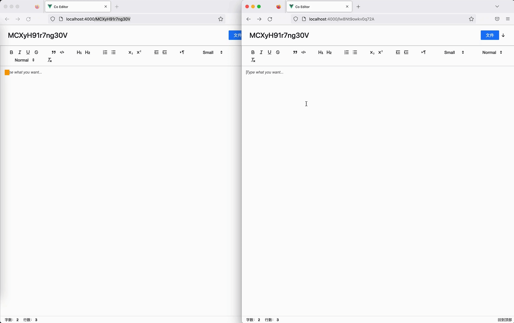

# co-editor

> 协同 markdown 编辑器  
> 正在疯狂撸代码中，还未开发完成，目前仅仅是一个 demo，还有大量细节、代码优化...

## TODO

- yjs 解析、深度实践
- 协同编辑优化
- 项目代码整理、重构
- so many others...

## examples

- [quill-yjs](./examples/quill-yjs): quill editor implement by yjs & Webrtc
- [crdts](./examples/crdts): simple CRDTs implement by js
- [monaco-yjs](./examples/monaco-yjs): monaco editor implement by yjs & Webrtc
- [ot-go](./examples/ot-go): OT alg implement & example by go
- [otjs-demo](./examples/otjs-demo): ot.js examples
- [simple-crdt](./examples/simple-crdt): simple CRDT example
- [yjs-demo](./examples/yjs-demo): yjs examples

## projects

- [backend](./projects/backend)
- [frontend](./projects/frontend)
- [common](./projects/common)

## references

see [references](./docs/)

## thanks

- [yjs](https://docs.yjs.dev/)
- [juejin](https://juejin.cn/)
- [SharedPen](http://objcer.com/2018/03/05/SharedPen/#more)
